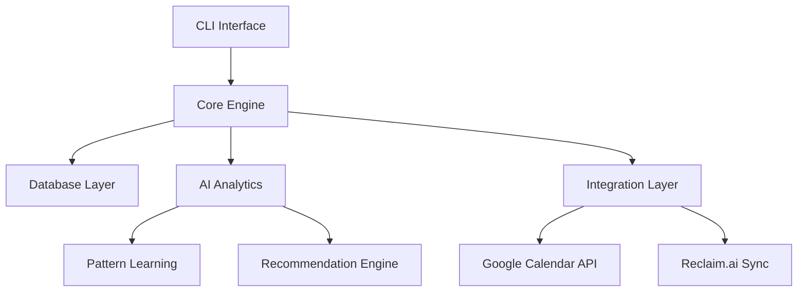

## Architecture Overview



## Core Components

### 1. CLI Interface Layer

**Purpose**: User interaction and command processing **Location**: `/src/cli/`

#### Commands Structure

```bash
nexus goals add "Learn React" --deadline "2025-08-31" --priority high
nexus schedule tomorrow
nexus report daily
nexus analyze patterns
nexus sync calendar
```

#### Menu System

- **Main Menu**: Primary navigation hub
- **Context Menus**: Goal management, scheduling, reporting
- **Quick Actions**: Common tasks with minimal typing

### 2. Core Engine

**Purpose**: Business logic and orchestration **Location**: `/src/core/`

#### Modules

- **[[Goal Management System]]**: Goal CRUD, decomposition, progress tracking
- **[[Smart Scheduling Engine]]**: Task optimization, conflict resolution
- **[[Learning Analytics]]**: Pattern recognition, behavior analysis
- **Task Manager**: Task lifecycle, dependencies, prioritization

### 3. Database Layer

**Purpose**: Data persistence and retrieval **Technology**: SQLite for local storage **Location**: `/src/core/database.py`

#### Key Tables (see [[Database Schema]])

- `goals` - Long-term objectives
- `tasks` - Actionable items
- `daily_logs` - Performance tracking
- `patterns` - Learned behaviors
- `calendar_events` - Synced external events

### 4. Integration Layer

**Purpose**: External system connectivity **Location**: `/src/integrations/`

#### Integrations

- **[[Calendar Integration]]**: Bidirectional Google Calendar sync
- **Reclaim.ai Workflow**: Task export for scheduling
- **Future**: Todoist, Notion, GitHub (see [[Future Features]])

### 5. AI Analytics Engine

**Purpose**: Intelligence and learning **Location**: `/src/core/analytics.py`

#### Capabilities

- **Pattern Recognition**: Identify productivity patterns
- **Predictive Modeling**: Estimate task durations
- **Recommendation Engine**: Suggest optimal scheduling
- **Performance Analysis**: Track goal progress and efficiency

## Data Flow

### 1. Goal Creation Flow

```
User Input → Goal Parser → Goal Decomposer → Task Generator → Database Storage
```

### 2. Daily Planning Flow

```
Calendar Sync → Context Analysis → Task Prioritization → Schedule Optimization → Recommendation Output
```

### 3. Learning Flow

```
User Feedback → Pattern Extraction → Model Update → Improved Recommendations
```

## Key Design Decisions

### Local-First Architecture

**Decision**: All data stored locally in SQLite **Rationale**:

- Privacy control
- Offline functionality
- Fast access
- No subscription dependencies

### CLI-First Interface

**Decision**: Terminal-based interaction **Rationale**:

- Development speed
- Power user efficiency
- Integration with development workflow
- Future GUI can be added

### Modular Component Design

**Decision**: Loosely coupled modules **Rationale**:

- Easy testing
- Independent development
- Future extensibility
- Clear separation of concerns

## Performance Considerations

### Response Time Targets

- CLI command response: < 200ms
- Calendar sync: < 5 seconds
- Pattern analysis: < 1 second
- Database queries: < 50ms

### Scalability Limits

- Goals: 1000+ concurrent goals
- Tasks: 10,000+ tasks in database
- Daily logs: 5+ years of data
- Calendar events: 50,000+ events

## Security & Privacy

### Data Protection

- All data stored locally
- No external data transmission except API calls
- API keys stored in environment variables
- Regular backup recommendations

### API Security

- OAuth 2.0 for Google Calendar
- Secure token storage
- Rate limiting compliance

## Error Handling Strategy

### Graceful Degradation

- Calendar API failures → work with cached data
- Database corruption → automatic backup restoration
- Invalid user input → helpful error messages with suggestions

### Logging Strategy

- Debug logs for development
- Error logs for troubleshooting
- Performance logs for optimization

## Related Notes

- [[Database Schema]] - Detailed data structure
- [[API Design]] - Interface specifications
- [[Goal Management System]] - Core feature design
- [[Smart Scheduling Engine]] - Scheduling algorithms
- [[Calendar Integration]] - External system integration

## Future Architecture Considerations

- Microservices for web version
- API layer for mobile apps
- Cloud sync options
- Multi-user support

---

_Created: {{date}} | Last Updated: {{date}}_ _Tags: #architecture #design #technical_