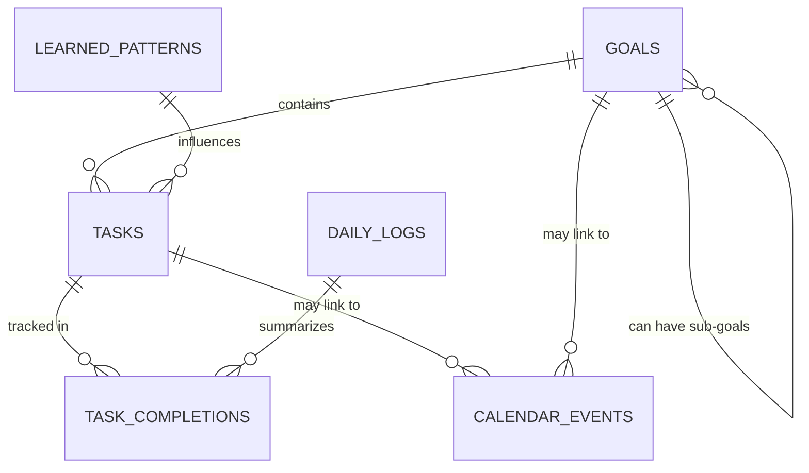

## Schema Overview

The database design follows a **goal-centric approach** where everything flows from high-level goals down to daily tasks and performance tracking.

## Design Decisions

### Calculated vs Stored Fields

**Philosophy**: Store raw data, calculate derived metrics

#### Calculated Fields (Not Stored)

- **Goal completion percentage**: Calculated from completed/total tasks
- **Goal progress velocity**: Calculated from recent completion rates
- **Average task duration**: Calculated from historical completions
- **Energy efficiency scores**: Calculated from performance data

#### Stored Fields

- **Raw timestamps**: All start/end times stored as entered
- **User inputs**: All user-provided data (estimates, priorities, notes)
- **External data**: Calendar events, system-generated IDs
- **Learned patterns**: AI-discovered patterns with confidence scores

**Rationale**: This approach ensures data consistency, enables flexible reporting, and prevents stale calculated data.

## Core Tables

### 1. Goals Table

**Purpose**: Store long-term objectives and track their decomposition

```sql
CREATE TABLE goals (
    id TEXT PRIMARY KEY,                    -- UUID for goal
    title TEXT NOT NULL,                    -- "Learn React Development"
    description TEXT,                       -- Detailed explanation
    category TEXT,                          -- "education", "health", "career"
    priority INTEGER CHECK(priority BETWEEN 1 AND 5),
    status TEXT CHECK(status IN ('active', 'completed', 'paused', 'cancelled')),
    target_completion_date DATE,            -- Target deadline
    actual_completion_date DATE,            -- When actually completed
    estimated_effort_hours INTEGER,         -- Total estimated time
    actual_effort_hours INTEGER DEFAULT 0,  -- Tracked actual time
    -- Note: completion_percentage is calculated from completed tasks, not stored
    success_criteria TEXT,                  -- How to measure success
    parent_goal_id TEXT,                    -- For goal hierarchies
    created_at TIMESTAMP DEFAULT CURRENT_TIMESTAMP,
    updated_at TIMESTAMP DEFAULT CURRENT_TIMESTAMP,
    FOREIGN KEY (parent_goal_id) REFERENCES goals(id)
);
```

### 2. Tasks Table

**Purpose**: Actionable items derived from goals

```sql
CREATE TABLE tasks (
    id TEXT PRIMARY KEY,
    goal_id TEXT NOT NULL,                  -- Links to parent goal
    title TEXT NOT NULL,
    description TEXT,
    category TEXT,                          -- "study", "practice", "project"
    priority INTEGER CHECK(priority BETWEEN 1 AND 5),
    status TEXT CHECK(status IN ('pending', 'in_progress', 'completed', 'cancelled')),
    
    -- Scheduling Information
    estimated_duration_minutes INTEGER,     -- How long it should take
    actual_duration_minutes INTEGER,        -- How long it actually took
    energy_level_required TEXT CHECK(energy_level_required IN ('low', 'medium', 'high')),
    preferred_time_of_day TEXT,            -- "morning", "afternoon", "evening"
    
    -- Dependencies & Constraints
    depends_on_task_id TEXT,               -- Task dependencies
    min_block_size_minutes INTEGER DEFAULT 30, -- Minimum time block needed
    max_block_size_minutes INTEGER,        -- Maximum useful time block
    can_be_split BOOLEAN DEFAULT TRUE,     -- Can this task be divided?
    
    -- Deadlines
    due_date DATE,                         -- Hard deadline
    soft_due_date DATE,                    -- Preferred completion date
    
    -- Recurrence
    is_recurring BOOLEAN DEFAULT FALSE,
    recurrence_pattern TEXT,               -- "daily", "weekly", "monthly"
    
    -- Metadata
    created_at TIMESTAMP DEFAULT CURRENT_TIMESTAMP,
    updated_at TIMESTAMP DEFAULT CURRENT_TIMESTAMP,
    completed_at TIMESTAMP,
    
    FOREIGN KEY (goal_id) REFERENCES goals(id),
    FOREIGN KEY (depends_on_task_id) REFERENCES tasks(id)
);
```

### 3. Calendar Events Table

**Purpose**: Store synced calendar data for context awareness

```sql
CREATE TABLE calendar_events (
    id TEXT PRIMARY KEY,                    -- Google Calendar event ID
    calendar_id TEXT,                       -- Which calendar (work/personal)
    title TEXT NOT NULL,
    description TEXT,
    
    -- Timing
    start_datetime TIMESTAMP NOT NULL,
    end_datetime TIMESTAMP NOT NULL,
    is_all_day BOOLEAN DEFAULT FALSE,
    timezone TEXT,
    
    -- Classification
    event_type TEXT,                        -- "meeting", "class", "exam", "personal"
    is_work_related BOOLEAN DEFAULT FALSE,
    importance INTEGER CHECK(importance BETWEEN 1 AND 5),
    
    -- Context
    location TEXT,
    attendees TEXT,                         -- JSON array of attendees
    
    -- System
    last_synced TIMESTAMP DEFAULT CURRENT_TIMESTAMP,
    is_deleted BOOLEAN DEFAULT FALSE,
    
    -- Links to our system
    related_goal_id TEXT,
    related_task_id TEXT,
    
    FOREIGN KEY (related_goal_id) REFERENCES goals(id),
    FOREIGN KEY (related_task_id) REFERENCES tasks(id)
);
```

### 4. Daily Logs Table

**Purpose**: Track daily performance and context for learning

```sql
CREATE TABLE daily_logs (
    id INTEGER PRIMARY KEY AUTOINCREMENT,
    log_date DATE NOT NULL,
    
    -- Daily Context
    sleep_hours REAL,                       -- Hours of sleep previous night
    sleep_quality INTEGER CHECK(sleep_quality BETWEEN 1 AND 5),
    energy_level INTEGER CHECK(energy_level BETWEEN 1 AND 5),
    mood INTEGER CHECK(mood BETWEEN 1 AND 5),
    stress_level INTEGER CHECK(stress_level BETWEEN 1 AND 5),
    
    -- Daily Performance
    total_productive_minutes INTEGER DEFAULT 0,
    tasks_completed INTEGER DEFAULT 0,
    tasks_planned INTEGER DEFAULT 0,
    goals_progressed TEXT,                  -- JSON array of goal IDs that progressed
    
    -- Reflections
    what_went_well TEXT,
    what_could_improve TEXT,
    tomorrow_priority TEXT,
    satisfaction_score INTEGER CHECK(satisfaction_score BETWEEN 1 AND 5),
    
    -- External Factors
    weather_condition TEXT,
    social_activities TEXT,
    exercise_minutes INTEGER DEFAULT 0,
    
    created_at TIMESTAMP DEFAULT CURRENT_TIMESTAMP
);
```

### 5. Task Completions Table

**Purpose**: Detailed tracking of individual task executions

```sql
CREATE TABLE task_completions (
    id INTEGER PRIMARY KEY AUTOINCREMENT,
    task_id TEXT NOT NULL,
    
    -- Execution Details
    started_at TIMESTAMP,
    completed_at TIMESTAMP,
    actual_duration_minutes INTEGER,
    planned_duration_minutes INTEGER,
    
    -- Context During Execution
    energy_level_during INTEGER CHECK(energy_level_during BETWEEN 1 AND 5),
    focus_quality INTEGER CHECK(focus_quality BETWEEN 1 AND 5),
    interruptions_count INTEGER DEFAULT 0,
    environment TEXT,                       -- "home", "library", "cafe"
    
    -- Performance
    difficulty_experienced INTEGER CHECK(difficulty_experienced BETWEEN 1 AND 5),
    satisfaction_with_outcome INTEGER CHECK(satisfaction_with_outcome BETWEEN 1 AND 5),
    percentage_completed INTEGER CHECK(percentage_completed BETWEEN 0 AND 100),
    
    -- Notes
    notes TEXT,
    obstacles_encountered TEXT,
    
    -- System
    completion_method TEXT,                 -- "manual", "automatic", "estimated"
    
    FOREIGN KEY (task_id) REFERENCES tasks(id)
);
```

### 6. Learned Patterns Table

**Purpose**: Store AI-discovered patterns for future recommendations

```sql
CREATE TABLE learned_patterns (
    id INTEGER PRIMARY KEY AUTOINCREMENT,
    pattern_type TEXT NOT NULL,             -- "productivity_peak", "task_duration", "goal_progress"
    pattern_name TEXT NOT NULL,
    
    -- Pattern Data
    pattern_data TEXT NOT NULL,             -- JSON with pattern details
    confidence_score REAL CHECK(confidence_score BETWEEN 0 AND 1),
    sample_size INTEGER,                    -- How many data points support this
    
    -- Validity
    discovered_at TIMESTAMP DEFAULT CURRENT_TIMESTAMP,
    last_validated TIMESTAMP,
    is_active BOOLEAN DEFAULT TRUE,
    
    -- Context
    applicable_conditions TEXT,             -- JSON: when this pattern applies
    
    UNIQUE(pattern_type, pattern_name)
);
```

### 7. System Settings Table

**Purpose**: Store configuration and preferences

```sql
CREATE TABLE system_settings (
    key TEXT PRIMARY KEY,
    value TEXT NOT NULL,
    data_type TEXT CHECK(data_type IN ('string', 'integer', 'boolean', 'json')),
    description TEXT,
    updated_at TIMESTAMP DEFAULT CURRENT_TIMESTAMP
);
```

## Key Relationships



## Indexes for Performance

```sql
-- Performance indexes
CREATE INDEX idx_tasks_goal_id ON tasks(goal_id);
CREATE INDEX idx_tasks_status ON tasks(status);
CREATE INDEX idx_tasks_due_date ON tasks(due_date);
CREATE INDEX idx_calendar_events_date ON calendar_events(start_datetime);
CREATE INDEX idx_daily_logs_date ON daily_logs(log_date);
CREATE INDEX idx_task_completions_task_id ON task_completions(task_id);
CREATE INDEX idx_task_completions_date ON task_completions(completed_at);
CREATE INDEX idx_learned_patterns_type ON learned_patterns(pattern_type);
```

## Sample Data Scenarios

### Goal Hierarchy Example

```
Goal: "Master React Development" (3 months)
├── Sub-goal: "Learn JavaScript ES6+" (2 weeks)
│   ├── Task: "Complete ES6 tutorial" (3 hours)
│   └── Task: "Practice async/await" (2 hours)
├── Sub-goal: "Build First React App" (4 weeks)
│   ├── Task: "Setup development environment" (1 hour)
│   ├── Task: "Complete React tutorial" (8 hours)
│   └── Task: "Build todo app" (12 hours)
└── Sub-goal: "Advanced React Concepts" (6 weeks)
    ├── Task: "Learn Context API" (4 hours)
    └── Task: "Learn React Router" (3 hours)
```

## Migration Strategy

### Version 1.0 → 1.1

- Add new columns with DEFAULT values
- Create migration scripts in `/scripts/migrations/`
- Backup before any schema changes

### Data Integrity Constraints

- Goals cannot be deleted if they have active tasks
- Tasks cannot be deleted if they have completion records
- Soft deletes preferred over hard deletes

## Related Notes

- [[System Design]] - How this fits into overall architecture
- [[Goal Management System]] - How goals table is used
- [[Learning Analytics]] - How patterns table enables AI
- [[API Design]] - How external systems interact with this data

---

_Created: {{date}} | Last Updated: {{date}}_ _Tags: #database #schema #technical #data-structure_